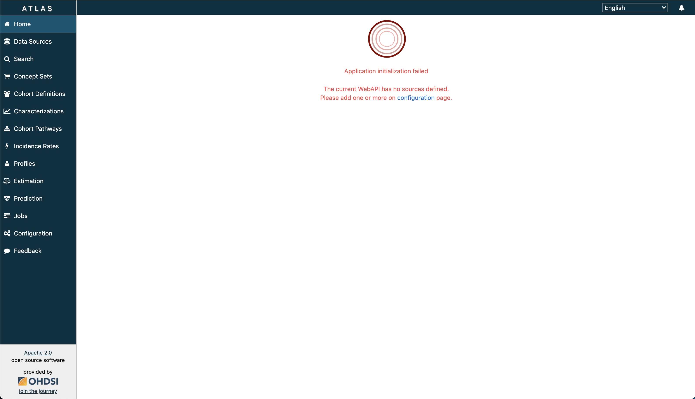
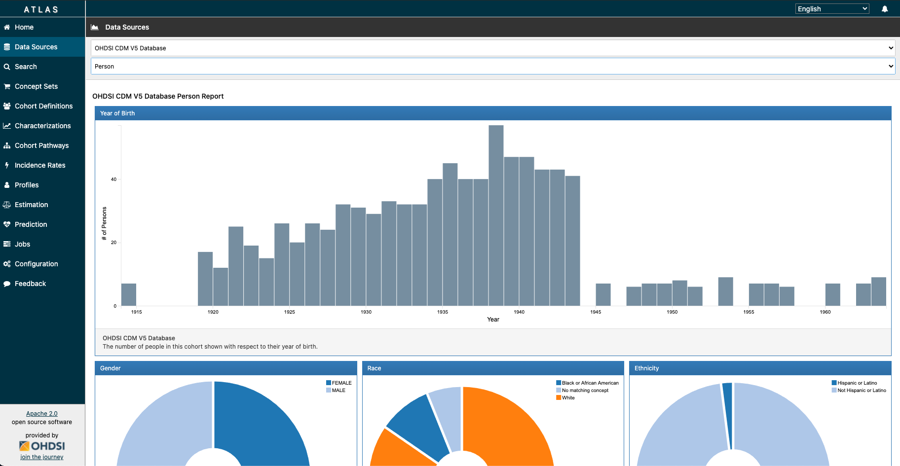

# OMOP CDM v5 Bootstrap

This will help you get a simple OMOP CDM v5 up and running using Azure SQL Server. The Terraform files will automate the creation of necessary resources (i.e. SQL Server, SQL database) to stand up an OHDSI OMOP CDM v5 (along with its web tools such as - Atlas, R and Achilles), and also _optionally_ import a vocabulary and/or data to get you started.

## Prerequisites

1. Install `sqlcmd`:
    - If on Mac:
    ```
    brew tap microsoft/mssql-release https://github.com/Microsoft/homebrew-mssql-release
    brew update
    brew install mssql-tools
    ```
    You can also visit [here](https://docs.microsoft.com/en-us/sql/linux/sql-server-linux-setup-tools?view=sql-server-ver15#macos)
    - If on Windows, visit [here](https://docs.microsoft.com/en-us/sql/tools/sqlcmd-utility?view=sql-server-ver15)
2. Install `bcp`. If you followed the instructions from Step 1, you may skip this step.
3. Clone this repository.
4. Download the CMD Vocabulary and move them into the `vocab/` directory of this repo. You can do this by visiting [Athena](https://athena.ohdsi.org/).
5. If you would like to install the OMOP CDM with sample data from SynPuf, then unzip the `/synpuf_data/synpuf1k_omop_cdm_5.x.x.zip` and make sure the `synpuf_data_import.sh` in the `scripts/` directory is pointing to the unzipped version.
6. Install Terraform version `v0.14.6` (or greater) locally

## Azure Authentication and Subscription Selection

Open a terminal, the first thing we need to do is log into our subscription.

```
az login
```
Then we can list the subscriptions we have access to.
```
az account list -o table
```

Set you subscription appropriately.
```
az account set --subscription <your_subscription_id>
```

## Set environment variables

You can either set your environment variables during runtime or leverage a tfvars file to prepopulate the values before the run. For this walk through we will use the
.tfvars file.

Take the [terraform.sample.tfvars](terraform/terraform.sample.tfvars), make a copy and rename it to `terraform.tfvars`. Terraform will automatically pick up these environment variables. Populate the values in the .tfvars file.

## Run Terraform

1. `terraform init`
2. `terraform plan`
    - Provide a password for SQL Server `omop_admin`. (Must contain uppercase, lowercase, and special character.)
    - Provide a prefix name. For example "yvonne". (**Note**: this is not the same as environment name (i.e. `dev`)).
    - This could also be done using a `.tfvars` file.
3. `terraform apply`
    - Provide similar input for `terraform plan` if not using a `.tfvars` file.
4. BE PATIENT - it can take OHDSI WebAPI and Atlas ~5-10 minutes to boot up normally.

**DISCLAIMER**: The execution of `terraform apply` can take about 45-60 minutes if importing the vocabulary set due to the size of the vocabulary csv files, which are often a total of a few gigabytes.

**ANOTHER DISCLAIMER**: If you are able to access Atlas, but are seeing the following error:



This means that you have not given the deployment enough time to configure data sources for WebAPI. Please wait about 15 minutes, and if you are still seeing this error, you can configure the source manually:

1. Connect to the SQL database. You can use various database IDEs like Azure Data Studio.
2. Run the query in `../sql/source_sourcce_daimon.sql` against your database.
3. Go to browser, and navigate to `https://{prefix}-{environment}-omop-broadsea.azurewebsites.net/WebAPI/source/refresh`.

If you got to `http://{prefix}-{environment}-omop-broadsea.azurewebsites.net/atlas/#/configure`, you should now see a new source entry. Refresh Atlas, and you will no longer be prompted with the error.

## Vocabulary and Data Import

You can also import the vocabulary outside of Terraform, which can drastically improve infrastructure deployment time. This is the recommended approach in case Terraform deployment errors out, and in which case, the state of the Terraform resource(s) may become "tainted". It may be challenging to resume the deployment when this occurs, and you may need to start over (i.e. perform a terraform destroy and reapply).

To import the vocabulary and synthetic data manually, be sure to comment out the vocab and data import in the Terraform `main.tf` script (lines 153-156 and lines 163-166, respectively) and use the script `vocab_import.sh` and `synpuf_data_import.sh`, respectively, in the `\scripts` directory. You may need to modify the path to `CSV_FILES` to point to the path of your vocabulary csv files.

### Loading Clinical Data 

[Staging Tables SQL Script](./sql/OMOP_CDM_sql_server_staging_ddl_indexes.sql) is currently executed in the Terraform to aid in loading clinical data into the OMOP CDM database, where, new clinical data can be added to the target staging table and eventually migrated to the permanent clinical table using a SQL Stored Procedure or an alternative approach. You can comment out this import in the Terraform `main.tf` script (lines 154-156) if this isn't desired. 

## Using Achilles

Running the Achilles R package on your CDM database is currently a requirement in order to characterize the datasaet and generate results that can be consumed by Atlas Data Sources. To do this:

1. Navigate to `http://{prefix}-{environment}-omop-webtools.azurewebsites.net/`.
2. Provide username and password. By default, they should be:
    username: ohdsi
    password: ohsi
3. Load Achilles library.
4. Create a connection:

    ```
    connectionDetails <- createConnectionDetails(dbms = "sql server", connectionString = "jdbc:sqlserver://{prefix}-{environment}-omop-sql-server.database.windows.net:1433;database={prefix}_{environment}_omop_db;user=omop_admin@{prefix}-{environment}-omop-sql-server;password={password};encrypt=true;trustServerCertificate=false;hostNameInCertificate=*.database.windows.net;loginTimeout=30;", user = "omop_admin", password = {password})
    ```

5. Run Achilles:

    ```
    achilles(connectionDetails = connectionDetails,
              cdmDatabaseSchema = "{databaseName}.{schema}",
              resultsDatabaseSchema = "{databaseName}.{schema}",
              vocabDatabaseSchema = "{databaseName}.{schema}",
              sourceName = "OHDSI CDM V5 Database",
              cdmVersion = 5.3,
              numThreads = 1,
              runHeel = FALSE,
              outputFolder = "output")
    ```

If you navigate to Atlas Data Sources, you should be able to see reports for the drop down menu items:



## Troubleshooting

### Error: Error running command '../scripts/synpuf_data_import.sh test-dev-omop-sql-server.database.windows.net test-dev-omop-db omop_admin omop_password': exit status 126. Output: /bin/sh: ../scripts/synpuf_data_import.sh: Permission denied

This could mean that the script has restricted access. You can change permissions by running:

```
chmod +x /scripts/synpuf_data_import.sh
```

You may be required to change permissions for the file `vocab_import.sh` as well.

### Error: Msg 40544, Level 17, State 12, Line 1 The database 'test-dev-omop-db' has reached its size quota. Partition or delete data, drop indexes, or consult the documentation for possible resolutions.

This message is in regards to the `omop_db_size`. If you are having problems with performing SQL queries, you may need to increase the SQL database maximum storage size.

### Error: sqlcmd: command not found

If you have installed sqlcmd and bcp but you still run into a command not found error it may be because you do not have a proper symlink created. See [this page](https://sqlserveronlinuxbackup.com/sqlcmd-command-not-found-ubuntu/) on how to fix this issue.

### r: Error executing SQL: com.microsoft.sqlserver.jdbc.SQLServerException: Incorrect syntax near 'analysis_id'. An error report has been created at  /home/ohdsi/errorReport.txt Error in rJava::.jcall(metaData, "Ljava/sql/ResultSet;", "getCatalogs") : com.microsoft.sqlserver.jdbc.SQLServerException: Connection reset

You may see this error message in R when you attempt to load the Achilles function described in [Using Achilles](https://github.com/yradsmikham/omop-cdmv5-boostrap#using-achilles). Because the syntax “drop index if exists” doesn’t work for all OHDSI SQL platforms, when the “drop index” step fails if you do not already have an index, it throws an error message. For now, this is a harmless error. Similar to a bug described [here](https://github.com/OHDSI/Achilles/issues/461).

## Footnotes

- [x] Package Tomcat Server, WebAPI, Atlas - Deploying docker container in Azure App Service
- [x] Azure Key vault support for App Service secrets
- [x] R Server + Achilles
- [ ] Implementation of CI/CD in Azure DevOps pipelines to build custom Docker images
- [ ] ETL
- [ ] Testing and managing multiple databases
- [ ] Observability
- [ ] Authentication
